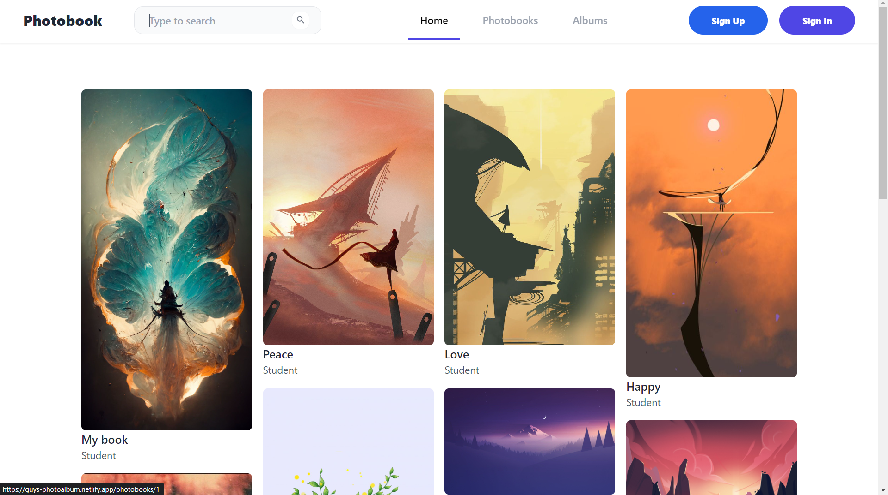

<div id="top"></div>
<!--
*** Thanks for checking out the Best-README-Template. If you have a suggestion
*** that would make this better, please fork the repo and create a pull request
*** or simply open an issue with the tag "enhancement".
*** Don't forget to give the project a star!
*** Thanks again! Now go create something AMAZING! :D
-->

<!-- PROJECT SHIELDS -->
<!--
*** I'm using markdown "reference style" links for readability.
*** Reference links are enclosed in brackets [ ] instead of parentheses ( ).
*** See the bottom of this document for the declaration of the reference variables
*** for contributors-url, forks-url, etc. This is an optional, concise syntax you may use.
*** https://www.markdownguide.org/basic-syntax/#reference-style-links
-->

[![Contributors][contributors-shield]][contributors-url]
[![Forks][forks-shield]][forks-url]
[![Stargazers][stars-shield]][stars-url]
[![Issues][issues-shield]][issues-url]
[![MIT License][license-shield]][license-url]

<!-- PROJECT LOGO -->
<br />
<div align="center">
  <!-- <a href="https://github.com/GuysKapen/ELearningLaravel">
    
  </a> -->

<h3 align="center">PhotoAlbum</h3>

  <p align="center">
    An PhotoAlbum Website
    <br />
    <a href="https://github.com/GuysKapen/ELearningLaravel"><strong>Explore the docs »</strong></a>
    <br />
    <br />
    <a href="https://github.com/GuysKapen/ELearningLaravel">View Demo</a>
    ·
    <a href="https://github.com/GuysKapen/ELearningLaravel/issues">Report Bug</a>
    ·
    <a href="https://github.com/GuysKapen/ELearningLaravel/issues">Request Feature</a>
  </p>
</div>

<!-- TABLE OF CONTENTS -->
<details>
  <summary>Table of Contents</summary>
  <ol>
    <li>
      <a href="#about-the-project">About The Project</a>
      <ul>
        <li><a href="#built-with">Built With</a></li>
      </ul>
    </li>
    <li>
      <a href="#getting-started">Getting Started</a>
      <ul>
        <li><a href="#prerequisites">Prerequisites</a></li>
        <li><a href="#installation">Installation</a></li>
      </ul>
    </li>
    <li><a href="#usage">Usage</a></li>
    <li><a href="#roadmap">Roadmap</a></li>
    <li><a href="#contributing">Contributing</a></li>
    <li><a href="#license">License</a></li>
    <li><a href="#contact">Contact</a></li>
    <li><a href="#acknowledgments">Acknowledgments</a></li>
  </ol>
</details>

<!-- ABOUT THE PROJECT -->

## About The Project



### Built With

- [![Vue][vue.com]][node-url]
- [![Node.js][node.com]][node-url]
- [![Express.js][express.com]][express-url]

<!-- GETTING STARTED -->

## Getting Started

This is an example of how you may give instructions on setting up your project locally.
To get a local copy up and running follow these simple example steps.

### Prerequisites

This is an example of how to list things you need to use the software and how to install them.

- NPM
- Node JS
- PostgreSQL

Download and install packages using npm by following the official instructions.

```sh
npm install
```

### Installation

1. Clone the repo

   ```sh
   git clone https://github.com/GuysKapen/PhotoAlbum.git
   ```

2. Install NPM packages

   - On client:

   ```sh
   cd client && npm install
   ```

   - On server:

   ```sh
   cd server && npm install
   ```

3. Create database in photoalbum

   ```sh
   database create photoalbum;
   ```

4. Modify environment variables (db_type, host, port, username, password, ...) in .env file

   ```sh
   DB_TYPE=db_type
   DB_HOST=host
   DB_PORT=port
   DB_USER=username
   DB_PASSWORD=password
   DB_NAME=db_name
   ```

5. Import data into postgres

   ```sh
   PGPASSWORD=<password> psql -h <host> -U <user> <db_name> -f /path/to/postgresql.sql
   ```

6. Start client, server and browse in browsers

   - On client:

   ```sh
   cd client && npm run dev
   ```

   - On server:

   ```sh
   cd server && npm run start
   ```

   <!-- USAGE EXAMPLES -->

## Usage

- For Developers:

  - Clone repo and start development as with Vue and Node Js
  - Add more photobook, album features
  - Add API for REST

- For Users:
  - Add photobooks, photopages to website and host it online
  - Add more meta data such as albums, ...

<!-- ROADMAP -->

## Roadmap

- [x] Basic feature
  - [x] Authenticate (signup, signin)
  - [x] Search photobooks/albums
  - [x] View detail photobooks
- [x] Photobook feature
  - [x] Add, delete, update photobook along with photopages
  - [x] Download photobook's images and images of photopages belong to it
  - [x] Add to favorite
- [x] album feature
  - [x] Add, delete, update album
  - [x] Add to favorite

See the [open issues](https://github.com/GuysKapen/ELearningLaravel/issues) for a full list of proposed features (and known issues).

<!-- CONTRIBUTING -->

## Contributing

Contributions are what make the open source community such an amazing place to learn, inspire, and create. Any contributions you make are **greatly appreciated**.

If you have a suggestion that would make this better, please fork the repo and create a pull request. You can also simply open an issue with the tag "enhancement".
Don't forget to give the project a star! Thanks again!

1. Fork the Project
2. Create your Feature Branch (`git checkout -b feature/AmazingFeature`)
3. Commit your Changes (`git commit -m 'Add some AmazingFeature'`)
4. Push to the Branch (`git push origin feature/AmazingFeature`)
5. Open a Pull Request

<!-- LICENSE -->

## License

Distributed under the Apache License, Version 2.0. See `LICENSE.txt` for more information.

<!-- CONTACT -->

## Contact

Guys - guyskapen@gmail.com

Project Link: [https://github.com/GuysKapen/PhotoAlbum](https://github.com/GuysKapen/PhotoAlbum)

<!-- ACKNOWLEDGMENTS -->

## Acknowledgments

- [NPM](https://www.npmjs.com/)
- [Vue.js](https://vuejs.org/)
- [Node.js](https://nodejs.org/)
- [Express.js](https://expressjs.com/)
- [Knex.js](https://knexjs.org/)
- [Postgresql](https://postgresql.org/)
- [TailwindCSS](https://tailwindcss.com/)

<!-- MARKDOWN LINKS & IMAGES -->
<!-- https://www.markdownguide.org/basic-syntax/#reference-style-links -->

[contributors-shield]: https://img.shields.io/github/contributors/GuysKapen/ELearningLaravel.svg?style=for-the-badge
[contributors-url]: https://github.com/GuysKapen/ELearningLaravel/graphs/contributors
[forks-shield]: https://img.shields.io/github/forks/GuysKapen/ELearningLaravel.svg?style=for-the-badge
[forks-url]: https://github.com/GuysKapen/ELearningLaravel/network/members
[stars-shield]: https://img.shields.io/github/stars/GuysKapen/ELearningLaravel.svg?style=for-the-badge
[stars-url]: https://github.com/GuysKapen/ELearningLaravel/stargazers
[issues-shield]: https://img.shields.io/github/issues/GuysKapen/ELearningLaravel.svg?style=for-the-badge
[issues-url]: https://github.com/GuysKapen/ELearningLaravel/issues
[license-shield]: https://img.shields.io/github/license/GuysKapen/ELearningLaravel.svg?style=for-the-badge
[license-url]: https://github.com/GuysKapen/ELearningLaravel/blob/master/LICENSE.txt
[linkedin-shield]: https://img.shields.io/badge/-LinkedIn-black.svg?style=for-the-badge&logo=linkedin&colorB=555
[linkedin-url]: https://linkedin.com/in/linkedin_username
[product-screenshot]: images/screenshot.png
[next.js]: https://img.shields.io/badge/next.js-000000?style=for-the-badge&logo=nextdotjs&logoColor=white
[next-url]: https://nextjs.org/
[react.js]: https://img.shields.io/badge/React-20232A?style=for-the-badge&logo=react&logoColor=61DAFB
[react-url]: https://reactjs.org/
[vue.js]: https://img.shields.io/badge/Vue.js-35495E?style=for-the-badge&logo=vuedotjs&logoColor=4FC08D
[vue-url]: https://vuejs.org/
[angular.io]: https://img.shields.io/badge/Angular-DD0031?style=for-the-badge&logo=angular&logoColor=white
[angular-url]: https://angular.io/
[svelte.dev]: https://img.shields.io/badge/Svelte-4A4A55?style=for-the-badge&logo=svelte&logoColor=FF3E00
[svelte-url]: https://svelte.dev/
[laravel.com]: https://img.shields.io/badge/Laravel-FF2D20?style=for-the-badge&logo=laravel&logoColor=white
[laravel-url]: https://laravel.com
[bootstrap.com]: https://img.shields.io/badge/Bootstrap-563D7C?style=for-the-badge&logo=bootstrap&logoColor=white
[bootstrap-url]: https://getbootstrap.com
[jquery.com]: https://img.shields.io/badge/jQuery-0769AD?style=for-the-badge&logo=jquery&logoColor=white
[jquery-url]: https://jquery.com
[vue.com]: https://img.shields.io/badge/Vue.js-35495E?style=for-the-badge&logo=vue.js&logoColor=4FC08D
[vue-url]: https://vue.js
[node.com]: https://img.shields.io/badge/Node.js-43853D?style=for-the-badge&logo=node.js&logoColor=white
[node-url]: https://node.js
[express.com]: https://img.shields.io/badge/Express.js-404D59?style=for-the-badge
[express-url]: https://express.js
